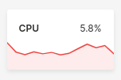

*Data buffers* are in-memory data structures designed to hold a card's tabular data.

Data buffers make it convenient to separate data (what is displayed) from presentation (how it is displayed). You can declare a card once, and update its underlying data buffer multiple times. A card can hold zero or more data buffers.

## Cards and buffers

Data buffers are tabular data structures containing columns and rows. Different cards utilize data buffers in different ways. For example, the plot in the [ui.small_series_stat_card()](api/ui#small_series_stat_card) uses a data buffer called `plot_data` to hold time series data.



```py {5-7}
card = ui.small_series_stat_card(
    box=f'1 1 1 1',
    title='CPU',
    value='10%',
    plot_data=data('time usage', -15),
    plot_category='time',
    plot_value='usage',
))
```

In the above snippet, `data('time usage', -15)` defines a placeholder for a table with two columns (`time` and `usage`) and 15 rows (we'll get to why the `15` is negative shortly), and the card's `plot_category` and `plot_value` point to the two columns `time` and `usage`, respectively.

Appending *rows* (*tuples* or *records*) to the data buffer make the card plot those rows.

```py {2}
while True:
    card.plot_data[-1] = [get_time(), get_usage()]
    time.sleep(1)
```

The `while` loop above does something like this:

```py
card.plot_data[-1] = ['2020-10-05T02:10:20Z', 42.5]
card.plot_data[-1] = ['2020-10-05T02:10:21Z', 43.1]
card.plot_data[-1] = ['2020-10-05T02:10:22Z', 39.2]
card.plot_data[-1] = ['2020-10-05T02:10:23Z', 38.7]
```

## Types of buffers

There are three types of data buffers:

- **Array buffers** hold tabular data with a fixed number of rows, and allow random access to rows using 0-based integers as keys.
- **Cyclic buffers** also hold tabular data with a fixed number of rows, but do not allow random access to rows. They can only be appended to. Rows are first-in first-out (FIFO), and adding rows beyond its capacity overwrites the oldest rows.
- **Map buffers** (or dictionary buffers) hold tabular data with a variable number of rows, and allow random access to rows using string keys.

:::caution
Map buffers are convenient to use, but use more memory on the server compared to array buffers and cyclic buffers, so use them sparingly.
:::

## The data function

Use the `data()` function to declare a data buffer. The Wave server uses this declaration to allocate memory for the data buffer.

`data()` takes multiple arguments:

- `fields`: The names of columns, in order; a space-separated string or a list or a tuple (`'foo bar'` or `['foo', 'bar']` or `('foo', 'bar')`.
- `size`: The number of rows to allocate.
    - A positive row count creates an array buffer.
    - A negative row count creates a cyclic buffer.
    - A zero row count (or `None`) creates a map buffer.
- `rows`: A `dict` or `list` of rows to initialize the data buffer with. Each row can be a list or tuple.
    - For array or cyclic buffers, pass a list of rows.
    - For map buffers, pass a dict with strings as keys and rows as values.
- `columns`: A `list` of columns to initialize the data buffer with. All columns must be of the same length. The columns are automatically transposed to `rows`.
- `pack`: `True` to pack (compress) the provided rows or columns, use less memory on the server-side, and improve performance. Set `pack=True` if you intend to never make any changes to the data buffer once created. Defaults to `False`.

## Buffers in practice

Declare a 5-row buffer with columns `donut` and `price`.

```py
# Array buffer
b = data(fields='donut price', size=5)

# Cyclic buffer
b = data(fields='donut price', size=-5)

# Map buffer
b = data(fields='donut price')
```

Declare and initialize a 5-row buffer with columns `donut` and `price`.
```py
# Array buffer
b = data(fields='donut price', size=5, rows=[
    ['cream', 3.99],
    ['custard', 2.99],
    ['cinnamon', 2.49],
    ['sprinkles', 2.49],
    ['sugar', 1.99],
])

# Cyclic buffer
b = data(fields='donut price', size=-5, rows=[
    ['cream', 3.99],
    ['custard', 2.99],
    ['cinnamon', 2.49],
    ['sprinkles', 2.49],
    ['sugar', 1.99],
])

# Map buffer
b = data(fields='donut price', rows=dict(
    crm=['cream', 3.99],
    cst=['custard', 2.99],
    cin=['cinnamon', 2.49],
    spr=['sprinkles', 2.49],
    sug=['sugar', 1.99],
))
```

Modify a buffer row:

```py
# Array buffer
b[2] = ['cinnamon', 2.99]

# Cyclic buffer
b[-1] = ['fruit', 2.99] # replaces ['sugar', 1.99]

# Map buffer (the following two forms are equivalent)
b['cin'] = ['cinnamon', 2.99]
b.cin = ['cinnamon', 2.99]
```

Modify a buffer value:

```py
# Array buffer (the following two forms are equivalent)
b[2]['price'] = 2.99
b[2].price = 2.99

# Cyclic buffer (the following two forms are equivalent)
b[-1]['price'] = 2.99 # last donut on menu now costs 2.99
b[-1].price = 2.99

# Map buffer (the following three forms are equivalent)
b['cin']['price'] = 2.99
b['cin'].price = 2.99
b.cin.price = 2.99
```

## Packed buffers

If you intend to create tabular data once and never change individual rows or values, it is better to avoid allocating memory on the server by using a *packed buffer*. Packed buffers use less memory on the server and improve performance. To create a packed buffer, use `data(..., pack=True)`. Note that `size` is not required, and is ignored if provided.

```py
b = data(fields='donut price', rows=[
    ['cream', 3.99],
    ['custard', 2.99],
    ['cinnamon', 2.49],
    ['sprinkles', 2.49],
    ['sugar', 1.99],
], pack=True)
```

```py
b = data(fields='donut price', columns=[
    ['cream', 'custard', 'cinnamon', 'sprinkles', 'sugar'],
    [3.99 , 2.99, 2.49, 2.49, 1.99],
], pack=True)
```